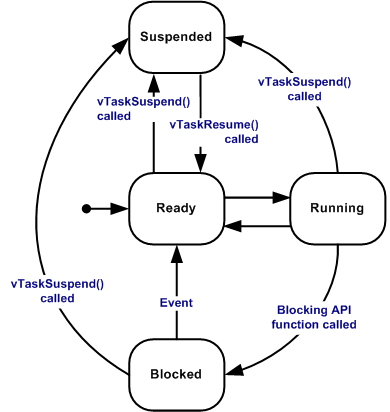

# Task

## Các state của Task (Statess of Task)



- **Ready**: Task sẵn sàng vào trạng thái Running. Các Task này chưa được thực thi vì có một Task khác đang chạy với mức ưu tiên cao hơn hoặc bằng nó.

- **Blocked**: Trạng thái Task chờ, muốn Running thì phải đưa về trạng thái Ready do các event tạm thời hoặc từ bên ngoài. Một Task Running có thể đưa về Blocked bằng các hàm API (Application Program Interface). Các Task Blocked thường có timeout, hết timeout thì Task sẽ unblocked cho dù event chưa xảy ra. Task có thể vào Blocked để đợi Queue, semaphore, event group, semaphore event.

- **Suspended**: Trạng thái treo, hoãn không cho hoạt động, để có thể Running thì phải đưa về trạng thái Ready bằng hàm *vTaskResume()*. Một Task Running, Ready, Blocked có thể đưa về Suspended bằng hàm *vTaskSuspend()*. Task Suspended không có timeout để đưa về Ready như Blocked.

- **Runing**: Task đang chạy (executing in CPU). Task này hiện đang sử dụng bộ xử lý.

Từ State Running &rarr; Not Running: "switched in", "swapped in".

Từ State Not Running &rarr; Running: "switched out", "swapped out".

## Task Prioritise

Mỗi Task được chỉ định mức độ ưu tiên từ `0 đến (configMAX_PRIORITIES - 1)`(FreeRTOSConfig.h).

```C
/* This has impact on speed of search for highest priority */
#define configMAX_PRIORITIES                            ( 25 )
```
**Số ưu tiên càng thấp thì mức ưu tiên càng thấp**. Idle Task có mức ưu tiên là 0 (tskIDLE_PRIORITY).

FreeRTOS luôn đảm bảo rằng các Task Ready hay Running là các Task có mức ưu tiên cao thay vì các Task có mức ưu tiên thấp.

Nhiều Task có thể có cùng chung một mức ưu tiên, và các Task này sẽ tuần hoàn với cùng một khoảng thời gian.

## Task Scheduling

Mặc định, FreeRTOS sử dụng chuẩn `fixed-priority preemptive scheduling`, `round-robin time-sliced` cho các Task có mức độ ưu tiên giống nhau.

- `fixed-priority`: scheduler sẽ không thay đổi mức ưu tiên của các Task.

- `preemptive`: scheduler sẽ luôn chạy các Task có mức ưu tiên cao nhất có thể chạy. Ví dụ khi ngắt (ISR) xảy ra làm thay đổi mức độ ưu tiên cao nhất của Task, scheduler sẽ dừng Task Running có mức ưu tiên thấp hơn và bắt đầu Running Task ISR, bất kể Task có đang trong time slice của nó.

- `round-robin`: các Task có cùng mức ưu tiên sẽ lần lượt vào Running state.

- `time-sliced`: scheduler sẽ switch giữa các Task có mức ưu tiên giống nhau mỗi lần xuất hiện tick interrupt. Khoảng thời gian giứa hai tick interrupt liên tiếp là một time-sliced.

Các Task có mức độ ưu tiên cao nên là các Task hướng sự kiện (event-driven). Để khi các Task này cần đợi event thì sẽ vào Blocked state, và các Task có mức ưu tiên thấp hơn sẽ được Running. Tránh tình trạng chỉ chạy các Task có mức ưu tiên cao và bỏ lỡ đi các Task mức ưu tiên thấp.

**Config FreeRTOS scheduling policy**

Trong file FreeRTOSConfig.h:

- `configUSE_PREEMPTION`:
  
  - `0`: quyền ưu tiên bị tắt (Preemption), switched Task chỉ xảy ra khi Task đang ở Running state switched out sang Block hoặc Suspended. Để switch Task thì Task đang Running phải gọi `taskYIELD()`, hoặc yêu cầu chuyển đổi ngữ cảnh ISR theo cách thủ công.

- `configUSE_TIME_SLICING`:

  - `0`: time-sliced bị tắt, các Task có mức ưu tiên giống nhau sẽ không switch với nhau mỗi lần tick interrupt.

## Tạo Task (Implementing a Task)

### Cấu trúc của một Task

```C
void vTaskFunction(void *pvParameters)
{
  while(1)
  {
    //Task application
  }

  //If Task need to exit 
  vTaskDelete(pxCreatedTask);
}
```

Khi khởi tạo Task, hàm vTaskFunction() sẽ có kiểu TaskFunction_t, được define là hàm void, và thông số đầu vào là con trỏ void.

Thông thường các Task nên được viết theo kiểu event-driven để cho bộ xử lý có thể chạy Task Idle, và để các Task có mức độ ưu tiên thấp hơn được chạy.

Cấu trúc thông thường của một Task event-driven:

```C
void vATaskFunction(void *pvParameters)
{
  while(1)
  {
    /* Psudeo code showing a task waiting for an event  with a block time. 
    If the event occurs, process it. If the timeout expires before the event occurs, then the system may be in an error state, so handle the error.  
    Here the pseudo code "WaitForEvent()" could replaced with xQueueReceive(), ulTaskNotifyTake(), xEventGroupWaitBits(), or any of the other FreeRTOS communication and synchronisation primitives. */
    if( WaitForEvent( EventObject, TimeOut ) == pdPASS )
    {
        // Handle event here.
    }
    else
    {
        // Clear errors, or take actions here.
    }
  }
  vTaskDelete( NULL );
}
```
### **Hàm tạo Task**

#### **`TaskHandle_t`**

> Type của Task được tham chiếu. Ví dụ: hàm xTaskCreate trả về (dạng pointer) là biến TaskHandle_t, biến này có thể sử dụng làm tham số cho hàm vTaskDelete() để xóa tác vụ.

#### **`xTaskCreate()`**
 
 > Dùng để tạo một Task mới và thêm Task này vào list của Ready state.

```C
BaseType_t xTaskCreate( TaskFunction_t pvTaskCode,
                        const char * const pcName,
                        configSTACK_DEPTH_TYPE usStackDepth,
                        void *pvParameters,
                        UBaseType_t uxPriority,
                        TaskHandle_t *pxCreatedTask );
```


*Parameter:*
- **`pvTaskCode`**: Trỏ đến hàm của Task (tên của hàm khởi tạo Task).

- **`pcName`**: Discription name của Task, chủ yếu dùng để debug. Độ dài tối đa của `pcName` được define `configMAX_TASK_NAME_LEN` trong FreeRTOSConfig.h

  ```C
  #ifndef configMAX_TASK_NAME_LEN
    #define configMAX_TASK_NAME_LEN    16
  ```

- **`usStackDepth`**: Dung lượng để phân bổ cho Stack của Task. Theo FreeRTOS thì tham số này là word, còn FreeRTOS trong esp32 tính theo byte.

- **`pvParameters`**: Tham số truyền vào hàm của Task.

- **`uxPriority`**: Mức độ ưu tiên của Task.

- **`pxCreatedTask`**: Được sử dụng để handle các tác vụ liên quan đến Task. Thường sẽ khởi tạo tham số này bằng NULL.

  ```C
    TaskHandle_t xHandle = NULL;
    xTaskCreate(..., &xHandle);

    //Use the Task's Handle to delete a Task
    vTaskDelete(xHandle);
  ```

*Return:*

- Nếu tạo Task thành công thì `pdPASS` sẽ được trả về.

- Nếu tạo Task khôn thành công thì sẽ trả về `errCOULD_NOT_ALLOCATE_REQUIRED_MEMORY`.

#### **`vTaskDelele()`**

> Xóa một Task khỏi Kernel RTOS management. Task sẽ bị xóa khỏi tất cả các list của Ready, Blocked, Suspended, Event.

> Lưu ý: Idle Task sẽ giải phóng bộ nhớ của các Task bị xóa được cấp phát trong Kernel RTOS. Vì vậy Idle Task phải đảm bảo được Running. Bộ nhớ được cấp phát cho Task không được giải phóng tự động và phải được free trước khi Task được xóa.

```C
void vTaskDelete( TaskHandle_t xTask );
```
*Parameters:*

- **`xTask`**: Handle của Task bị xóa. Nếu truyền vào NULL làm cho Task đang gọi bị xóa.

### **Task Control**

#### **`vTaskDelay`**

> Delay một Task trong một số Ticks xác định. Thời gian thực tế mà Task Blocked phụ thuộc vào tick rate. Hằng số `portTICK_PERIOD_MS` dùng để tính toán thời gian thực với tick rate cho khoảng thời gian delay là milisecond.
> Hàm này chỉ định thời gian mà Task muốn được Unblocked kể từ lúc gọi hàm. `vTaskDelay()` không tốt cho việc kiếm soát tần số của các Task theo chu kỳ vì path sẽ được thực hiện bằng code (?), cũng như các Task khác và ngắt sẽ ảnh hưởng tới tần sô của hàm này.

```C
void vTaskDelay( const TickType_t xTicksToDelay );
```

*Parameters:*

- **`xTicksToDelay`**: Lượng thời gian làm Task switch in Blocked state, tính theo chu kỳ Tick. `time_in_ms / portTICK_PERIOD_MS`.

#### **`v--xTaskDelayUntil()`**

> Delay một Task cho đến một thời điểm xác định. Hàm này có thể sử dụng bởi các Task theo chu kỳ để đảm bảo tần suất thực thi không đổi.
> Hàm này khác với `vTaskDelay()` ở điểm: `vTaskDelay()` chỉ định thời gian Task Blocked kể từ lúc gọi hàm `vTaskDelay()`, trong khi vTaskDelayUntil() chỉ định thời gian tuyệt đối mà Task muốn unblocked.
> Không nên gọi hàm này khi Scheduler đang bị Blocked bởi việc gọi hàm `vTaskSuspendAll()`.

```C
void vTaskDelayUntil( TickType_t *pxPreviousWakeTime,
                      const TickType_t xTimeIncrement );
```

```C
BaseType_t xTaskDelayUntil(   TickType_t *pxPreviousWakeTime,
                              const TickType_t xTimeIncrement   );
```

*Parameters:*

- **`pxPreviousWakeTime`**: Con trỏ trỏ đến biến giữ thời gian làm cho Task Blocked. Biến phải được khởi tạo trước khi gọi hàm. Sau đó biến tự động cập nhật trong vTaskDelayUntil().
- **`xTimeIncrement`**: Khoảng thời gian của chu kỳ. Task sẽ được unblocked tại thời điểm `(*pxPreviousWakeTime + xTimeIncrement)`. Gọi vTaskDelayUntil() với cùng giá trị tham số xTimeIncrement sẽ khiến Task thực thi với một khoảng thời gian nhất định.

*Return :*
- Đối với hàm `xTaskDelayUntil()`, `pdTRUE` sẽ được trả về nếu đã được delay, ngược lại trả về `pdFALSE.`
- Một Task sẽ không được delay khi thời gian đánh thức tiếp theo ở trong quá khứ.

*Example:*

```C
//Code application after 10 ticks.
void vTaskFunction(void * pvParameter)
{
  TickType_t xLastWakeTime;
  const TickType_t xFrequence = 10;

  // Initialise the xLastWakeTime variable with the current time.
  xLastWakeTime = xTaskGetTickCount();

  while(1)
  {
    //Wait for the next cycle
    vTaskDelayUntil(&xLastWakeTime, xFrequence);
    //Code application
  }
}
```

#### **`uxTaskPriorityGet`**

> Dùng hàm này để biết được mức độ ưu tiên của một Task.

```C
UBaseType_t uxTaskPriorityGet(  TaskHandle_t xTask  );
```

*Parameters:*

- **`xTask`**: Con trỏ trỏ đến Handle của Task.

*Return :*
- Mức độ ưu tiên của Task

*Example:*

```C
void vAFunction( void )
{
  TaskHandle_t xHandle;
  // Create a task, storing the handle.
  xTaskCreate( vTaskCode, "NAME", STACK_SIZE, NULL, tskIDLE_PRIORITY, &xHandle );
  // ...
  // Use the handle to obtain the priority of the created task.
  // It was created with tskIDLE_PRIORITY, but may have changed
  // it itself.
  if( uxTaskPriorityGet( xHandle ) != tskIDLE_PRIORITY )
  {
      // The task has changed its priority.
  }
  // ...  
  // Is our priority higher than the created task?
  if( uxTaskPriorityGet( xHandle ) < uxTaskPriorityGet( NULL ) )
  {
    // Our priority (obtained using NULL handle) is higher.
  }
 }
```

#### **`uxTaskPrioritySet`**

> Dùng hàm này để thiết lập mức ưu tiên cho Task.
> Chuyển đổi ngữ cảnh sẽ xảy ra trước khi hàm được trả về nếu mức độ ưu tiên của Task được set cao hơn Task Running.

```C
void vTaskSuspend(  TaskHandle_t xTaskToSuspend );
```

*Parameters:*

- **`xTask`**: Con trỏ trỏ đến Handle của Task.
- **`uxNewPriority`**: Mức ưu tiên mới được set cho Task. 


*Example:*

```C
 void vAFunction( void )
 {
 TaskHandle_t xHandle;
     // Create a task, storing the handle.
     xTaskCreate( vTaskCode, "NAME", STACK_SIZE, NULL, tskIDLE_PRIORITY, &xHandle );
     // ...
     // Use the handle to raise the priority of the created task.
     vTaskPrioritySet( xHandle, tskIDLE_PRIORITY + 1 )
     // ...
     // Use a NULL handle to raise our priority to the same value.
     vTaskPrioritySet( NULL, tskIDLE_PRIORITY + 1 );
 }
```

#### **`vTaskSuspend`**

> Suspended một Task. Khi switched in Blocked state, Task sẽ không thể nào chiếm thời gian của bộ xử lý của vi điều khiển, bất kể mức độ ưu tiên của nó là gì.

```C
void vTaskSuspend(  TaskHandle_t xTaskToSuspend );
```

*Parameters:*

- **`xTaskToSuspend`**: Con trỏ trỏ đến Handle của Task muốn switch in Suspend state. Truyền vào NULL sẽ khiến Task đang được gọi switched in Suspended.

#### **`vTaskResume`**

> Resume một Suspend Task.

```C
void vTaskResume( TaskHandle_t xTaskToResume );
```

*Parameters:*

- **`xTaskToResume`**: Handle của Task muốn Resume.

#### **`xTaskResumeFromISR`**

> Resume một Suspend Task.

```C
void vTaskResume( TaskHandle_t xTaskToResume );
```

*Parameters:*

- **`xTaskToResume`**: Handle của Task muốn Resume.

*Return:*

- `pdTRUE` nếu việc resume Task làm chuyển ngữ cảnh, ngược lại sẽ trả về `pdFLASE`.

#### **`xTaskAbortDelay`**

> Buộc một Task switch out Blocked state sang Ready state. Bất kể Task ở trong Blocked state đang đợi một event chưa xảy ra, hoặc bất cứ timeout nào được chỉ định.
> 

```C
BaseType_t xTaskAbortDelay( TaskHandle_t xTask );
```

*Parameters:*

- **`xTask`**: Handle của Task muốn Resume.

*Return:*

- `pdTRUE` nếu việc resume Task làm chuyển ngữ cảnh, ngược lại sẽ trả về `pdFLASE`.
